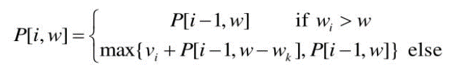

# DP

## Dynamic Programming(DP; 동적 프로그래밍)

> 메모리를 적절히 사용하여 수행 시간 효율성을 향상시키는 방법

<br>

### 1. 정의

- 이미 계산된 결과를 메모리에 저장(Memoization)하여 반복하여 계산하지 않도록 하여 시간 효율성 향상
- 다음의 조건을 만족하는 경우 DP 활용
  1. 최적 부분 구조 : 큰 문제를 작은 문제로 나누어 푸는 구조
  2. 중복 구조 : 동일한 작은 문제를 반복적으로 푸는 구조
- 1. Top-Down (하향식) : 재귀적
  2. Bottom-Up (상향식) : DP Table 작성, 반복문
- DP vs. 분할 정복
  - 두 알고리즘 모두 주어진 문제가 최적 부분 구조를 가질 때 활용
  - 주어진 문제의 부분 문제가 중복되는 경우 => DP
  - 동일한 부분 문제가 반복적으로 계산되지 않는 경우 => 분할 정복


### 2. 종류

#### 2.1 Knapsack(배낭 문제)

- 한 여행가가 가지고 있는 배낭에 담을 수 있는 무게의 최댓값이 정해져 있고, 일정 가지와 무게가 있는 짐을 배낭에 넣는다고 할 때 가치의 합이 최대가 되도록 짐을 고르는 문제

- Fractional Knapsack ; 짐을 쪼갤 수 있는 경우

  - greedy하게 무게당 가치가 높은 짐을 우선으로 배낭에 담음

- 0-1 Knapsack ; 짐을 쪼갤 수 없는 경우

  - 집합 A를 n개의 짐들 중 최적으로 고른 부분집합이라고 할 때,
  - 집합 A가 n번째 짐을 포함하고 있지 않다면, A는 n번째 짐을 뺀 나머지 n-1개의 짐들 중에서 최적으로 고른 부분집합과 같음
  - 집합 A가 n번째 짐을 포함하고 있다면, A에 속한 짐들의 총 가격은 n-1개의 짐들 중에서 최적으로 고른 가치의 합에 n번째 짐의 가치를 더한 것과 같음
  - 즉, 다음과 같은 점화식을 만족함 (w_i ; i번째 짐의 무게, v_i ; i번째 짐의 가치, P[i, w] ; i번째 짐에 대해 최대 무게가 w일 때의 최적의 가치)

  

#### 2.2 Longest Increasing Subsequence(LIS, 가장 긴 증가하는 부분 수열)

- 어떤 임의의 수열이 주어지고 이 수열에서 몇 개의 수들을 제거하여 부분수열을 만든다고 할 때, 만들어진 부분수열 중 오름차순으로 정렬된 가장 긴 수열을 찾는 문제
- LIS의 길이를 구하는 방법
  - 시간복잡도 O(n^2)
    - 주어진 배열 A에 대하여 D[i] : A[i]를 마지막 값으로 가지는 가장 긴 증가부분수열의 길이
    - D[i] = A[i]가 추가될 수 있는 증가부분수열 중 가장 긴 수열의 길이 + 1
    - 이 때 A[0] ~ A[i-1]을 살펴보면서 A[i] 보다 작은 경우 위의 점화식을 업데이트
  - 시간복잡도 O(nlogn)
    - 위의 방법에서 A[0] ~ A[i-1]의 모든 원소를 살펴보지 않고 증가하는 부분수열의 길이가 k일 때의 수열의 마지막 값의 최솟값을 저장해놓고 이를 통해 D[i]를 구함

#### 2.3 Travling Salesperson Problem(TSP, 외판원 순회)

<br>

### Ex1. 피보나치 수열

```python
# 일반적인 재귀함수 형태의 알고리즘
# 시간복잡도 ~ O(2^n)
def f(n):
    if n==1 or n==2:
        return 1
    else:
        return f(n-1)+f(n-2)
```

```python
# DP ; Top-down 방식
# 시간복잡도 ~ O(n)
D = [0] * 100 ; 

def f(n):
    if n==1 or n==2:
        return 1
    if D[n] > 0:
        return D[n]
    D[n] = f(n-1) + f(n-2)
    
    return D[n]
```

```python
# DP ; Bottom-up 방식
# 시간복잡도 ~ O(n)
n = 100

D = [0] * (n+1)
D[1] = 1
D[2] = 1

for i in range(3, n+1):
    D[i] = D[i-1] + D[i-2]
    
D[n]
```

### EX2. Knapsack

```python
# 0-1 knapsack problem

N, W = 4, 5  # N개의 짐, 최대 무게 W
w = [2, 3, 4, 5]
v = [3, 4, 5, 6]

knap = [[0 for _ in range(W+1)] for _ in range(N+1)]

for i in range(N+1):
    for j in range(W+1):
        if w[i-1] <= j: 
            knap[i][j] = max(v[i-1] + knap[i-1][j-w[i-1]],  knap[i-1][j]) 
        else: 
            knap[i][j] = knap[i-1][j] 
```

### EX3. LIS

```python
# LIS의 길이 구하기
# 1. 시간 복잡도 ~ O(n^2)
n = int(input())
arr = [0] + list(map(int, input().split()))

dp = [0] * (n+1)
for i in range(1, n+1):
    for j in range(i):
        if arr[j] < arr[i]:
            dp[i] = max(dp[i], dp[j]+1)
            
print(max(dp))
```

```python
# 2. 시간 복잡도 ~ O(nlogn)
from bisect import bisect_left

n = int(input())
arr = [0] + list(map(int, input().split()))

dp = [0] * (n+1)
dp_val = [0]
for i in range(1, n+1):
    
    idx = bisect_left(dp_val, arr[i])
    if idx == len(dp_val):
        dp_val.append(arr[i])
    else:
        dp_val[idx] = arr[i]
    dp[i] = idx
    
print(len(dp_val)-1)
```

<br>

### 참고 문제

- Baekjoon #1463 - [1로 만들기] : [problem](https://www.acmicpc.net/problem/1463), [solution](https://github.com/cgvvxx/algorithm_study/blob/master/ps/DP/033_B_1463.py)

- Baekjoon #12865 - [평범한 배낭] : [problem](https://www.acmicpc.net/problem/12865), [solution](https://github.com/cgvvxx/algorithm_study/blob/master/ps/DP/166_B_12865.py)

- Baekjoon #11053 - [가장 긴 증가하는 부분 수열] : 
